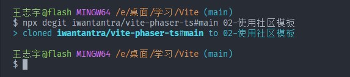

<!--
 * @Author: wangzhiyu <w19165802736@163.com>
 * @version: 1.0.0
 * @Date: 2023-12-17 20:30:17
 * @LastEditTime: 2023-12-18 21:34:00
 * @Descripttion: Vite学习笔记
-->

# Vite 学习笔记

## Vite 功能以及介绍

### 1. [熟悉并使用 vite](https://cn.vitejs.dev/guide/)

1. vite 的组成部分:

   - 一个开发服务器,基于原生 ES 模块提供了丰富的内建功能,例如模块热更新(HMR)
   - 一套构建指令,使用了 rollup 打包代码,并且它是预配置的,可以输出用于生产环境的高度优化过的静态资源

2. 手动搭建 vite 项目(见 01-手动搭建 vite 项目)

   ```js
   // 1. 执行命令行创建模板
   npm create vite@latest 或 yarn create vite

   // 2. 根据需要的框架以及技术栈选择对应的选项


   // 拓展: 使用附加的命令选项直接创建指定的框架与技术栈
   npm create vite@latest my-vue-app -- --template vue // 构建一个vite+vue的项目
   ```

3. 使用社区模板(见 02-使用社区模板)

   

   ```js
   // 1. 使用npx引用社区模板
   npx degit user/project#社区模板分支名称 02-使用社区模板

   // 2. 切换目录,初始化依赖包,启动开发服务器
   cd ./02-使用社区模板
   npm i
   npm run dev
   ```
